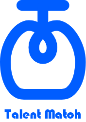

# Talent Match

## 프로젝트 소개
 - 너와 나의 재능 교환, Talent Match!
 - 값비싼 이색 과외, 이제 또래 친구들한테 배워요!
 - 광주에 없는 이색 수업, 편한 친구에게 원하는 배우고 알려줘요!
 - 내가 잘하는 걸 새로운 친구한테 알려주고, 반대로 그 친구한테 원하는 걸 배워보아요!
 - 자기소개를 보고 학업과 취미를 배우는 신개념 소개팅 어플, Talent Match!

## 기능 설명
 - 레슨 별 카테고리 분류로 어떤 상대가 있는지 찾아보아요!
 - 상대의 프로필을 보고 재능 교환을 신청해보아요!
 - 나의 프로필을 만들고 상대에게 신청을 수락해보세요!
 - 수락 시 상대와 연락할 수 있어요! 이제 만나서 배워보아요!

## 컴퓨터 구성 / 필수 조건 안내 (Prerequisites)
* For Android Users

## 기술 스택 (Technique Used) 
### Server(back-end)
 - node.js
 - MongoDB
 
### Front-end
 - Java
 - Android Studio

## 설치 안내 (Installation Process)
 - 아직 지원하지 않음

## 팀 정보 (Team Information)
 - KANG Dae-Hee (dany11242901@gmail.com), Github Id: meoheee
 - KIM Min-Ju
 - LEE Chae-Eun
 - KIM Eun-Bin
